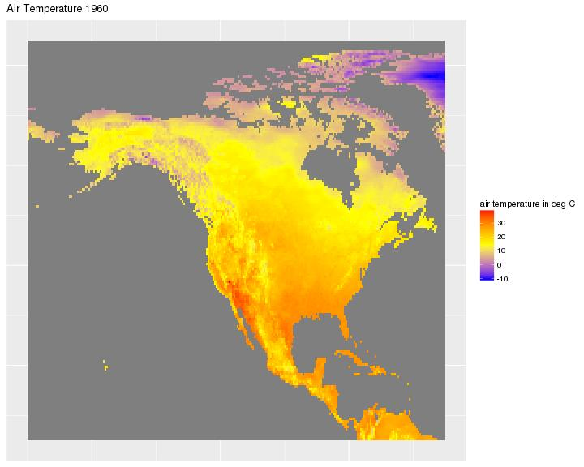
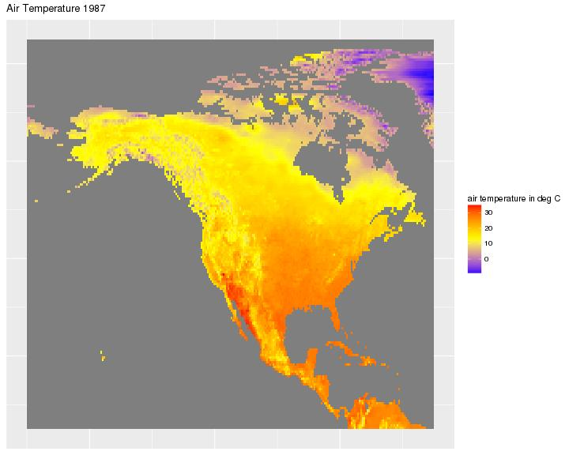
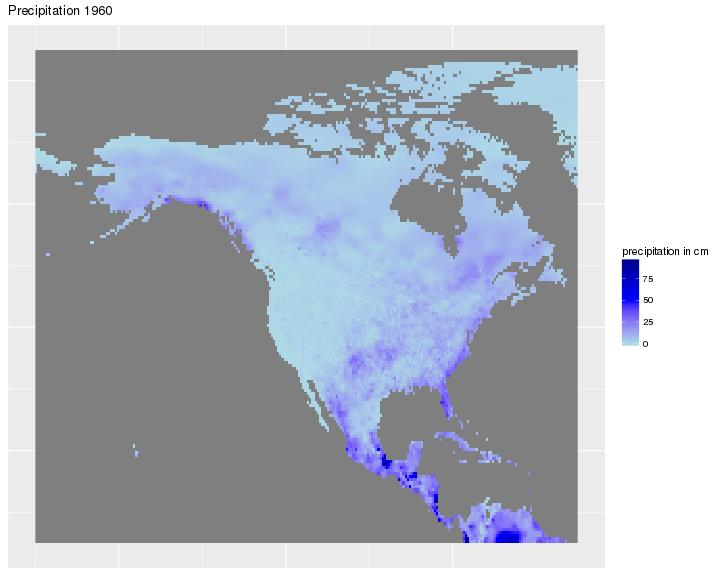
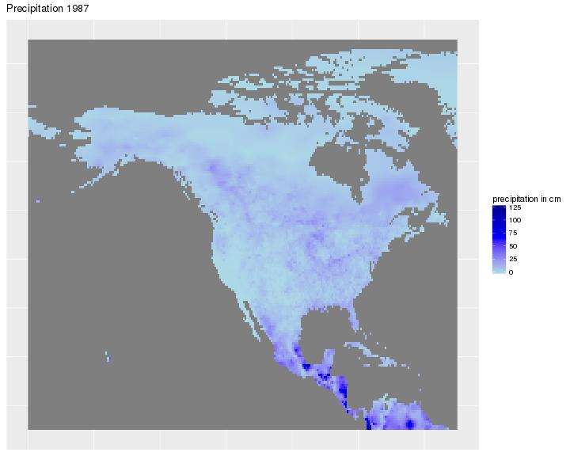
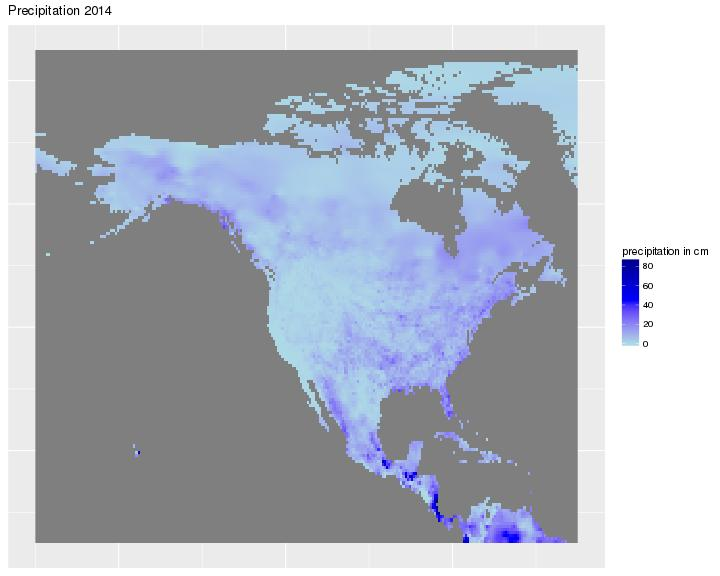

# Climate Report

## North American Temperature and Precipitation, 1960-2014

### Temperature

The temperature patterns look reasonable. The norther you go, the average air temperature will decrease and the nearer you go to the equator, the average air temperature will increase. There are no major differences between the year. If there is, the average air temperature in 1987 looks hotter.

### Precipitation

The precipitation patterns look reasonable. The nearer you go to the equator, the average precipitation will increase. There are no major differences between the year.

### Extra Credit: How to passwordless login

1. Run the command: ssh-keygen, use empty passphrase
2. Run the command: ssh-copy-id [netid]@info201.ischool.uw.edu
3. You're done
