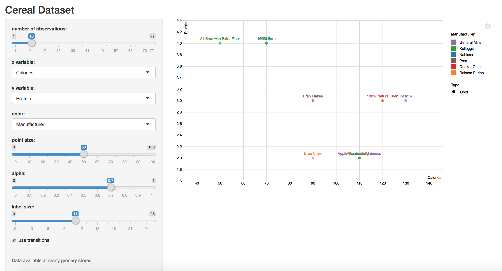

# Cereal Dataset
Visualizing the **_cereal dataset_**, a common dataset in the visualization world. The data was downloaded from *cmu.edu* into a tab separated file. Each of the **77 rows** of this data is a cereal type, and the columns express different nutritional information of the cereal. Link to the shiny app: [https://gilbertf.shinyapps.io/a8-shiny-gilbert-f/](https://gilbertf.shinyapps.io/a8-shiny-gilbert-f/).

As we can see, there are **8** widgets to change the visual representation of the dataset:
1. number of observations: determines the number of observations
2. x-axis: determines which variable becomes the x variable
3. y-axis: determines which variable becomes the y variable
4. color: determines which variable becomes the color variable
5. point size: determines the size of the points
6. point alpha: determines the transparency of the points
7. label size: determines the size of the labels
8. use transitions: determines whether transitions are used or not